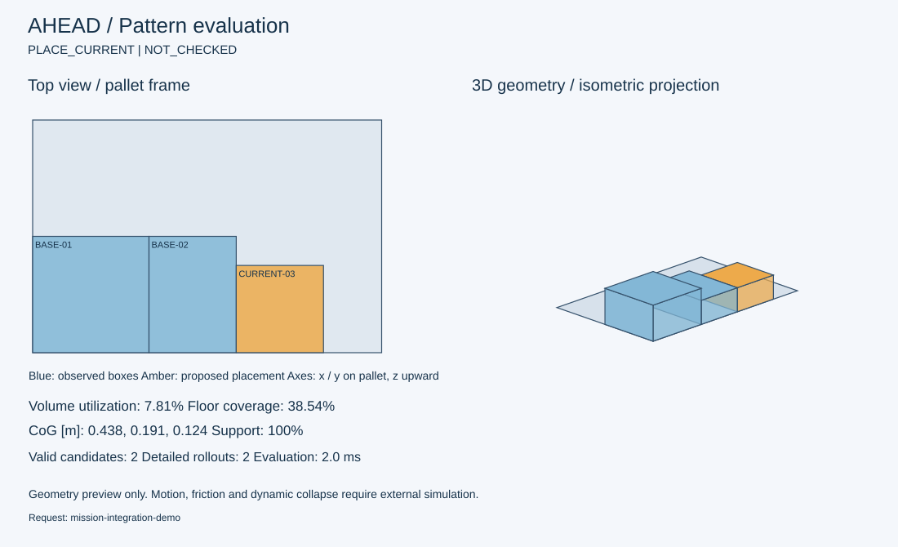

# 점수 기반 적재 패턴 평가

유효 배치 후보의 미래 성능을 신경망으로 예측하고, 상위 후보를 Rollout으로 재평가하는 AHEAD 구현입니다. 학습 모델, 조정된 가중치, 재학습 표적과 검증 결과를 포함하는 독립 실행 프로젝트입니다. 다른 저장소나 탑뷰 데이터셋 다운로드가 필요하지 않습니다.

0.3.0에서는 Mission 1의 다섯 평가 항목을 대조해 물리 단위 KPI, 로봇 검증·작업시간 연동, 순서 검사, 2D/등각 3D 표시를 보완했습니다. 구현 범위와 남은 검증은 [미션 요구사항 검토](projects/pattern_evaluation/MISSION_REVIEW.md)에 정리했습니다.

폴더·파일별 역할, 두 종류 학습, 실제 샘플의 점수 계산과 공유 설명은 [코드와 동작 해설](projects/pattern_evaluation/WALKTHROUGH_KO.md)을 참조하세요.

## 실행

Python 3.10 이상을 사용합니다. 프로젝트 루트에서 실행하세요.

```bash
python -m pip install .
ahead-planner plan --input projects/pattern_evaluation/artifacts/sample_observation.json
```

CLI 대신 다음과 같이 연결할 수 있습니다.

```python
from projects.pattern_evaluation import Planner

planner = Planner.released()
result = planner.plan(observation, candidates=generated_candidates)
```

기존 Python import와 관측·응답 계약을 그대로 유지했습니다. 응답은 배치 제안이며 실제 실행 전에 로봇 도달성·IK·충돌 검사가 필요합니다.

## 구성

| 경로 | 내용 |
|---|---|
| `projects/pattern_evaluation/` | 점수 계산, 신경망 Ranking, 미래 Rollout, 선반 행동과 HTTP API |
| `projects/pattern_evaluation/artifacts/` | 학습 모델·가중치·교사 표적·864회 검증 기록 |
| `projects/pattern_evaluation/examples/` | 미션 연동 입력·응답·순서 검증 예제와 SVG 표시 |
| `pacdata/` | 자체 포함된 관측·기하·하중 검사·특징 추출·합성 시험 코어 |

`pacdata`라는 모듈명은 기존 호출 호환성을 위해 유지했습니다. 데이터셋 모음, 탑뷰 다운로드 파일, 구버전 모델과 대량 데이터셋 생성·패키징 도구는 포함하지 않습니다. 시험용 합성 에피소드는 알고리즘 학습·검증 과정에서 생성합니다.

## 학습과 가중치 조정

```bash
# 제공된 교사 표적으로 신경망 재학습
OPENBLAS_NUM_THREADS=1 python -m projects.pattern_evaluation.fit ranker --train projects/pattern_evaluation/artifacts/train.labels.jsonl.gz --validation projects/pattern_evaluation/artifacts/validation.labels.jsonl.gz --out projects/pattern_evaluation/runs/retrained

# 별도 출력 폴더에서 학습·가중치 탐색·미사용 그룹 검증
OPENBLAS_NUM_THREADS=1 OMP_NUM_THREADS=1 python -m projects.pattern_evaluation.train --out projects/pattern_evaluation/runs/new_run

# 배포 체크포인트로 현재 코드의 별도 전체 검증 실행·재개
OPENBLAS_NUM_THREADS=1 python -m projects.pattern_evaluation.release --workers 4 --out projects/pattern_evaluation/runs/release-v0.3
```

가중치는 검증 에피소드 성능으로 탐색합니다. 안전 기준은 학습 대상에서 제외합니다. 수동 변경과 외부 후보 학습 방법은 [상세 사용법](projects/pattern_evaluation/README.md)을 참조하세요.

## 검증과 연동 문서

[미션 요구사항 검토](projects/pattern_evaluation/MISSION_REVIEW.md) · [연동 명세](projects/pattern_evaluation/INTEGRATION.md) · [설계 결정](projects/pattern_evaluation/DESIGN_DECISIONS.md) · [기존 학습 검증](projects/pattern_evaluation/VALIDATION.md) · [분리 기준](PROVENANCE.md)

```bash
OPENBLAS_NUM_THREADS=1 python -m unittest discover -s projects/pattern_evaluation/tests -v
```

기존 배포의 144개 공통 시험에 6개 정책을 적용한 864회 결과를 보존했습니다. 해당 평균 적재율은 Greedy 17.84%, AHEAD 19.45%, AHEAD + 선반 22.99%입니다. 0.3.0의 별도 미사용 재고 그룹 72회 비교에서는 Greedy 14.99%, AHEAD 16.58%였습니다. 시험 구성은 서로 다르므로 버전 간 성능 변화로 비교하지 않습니다. 자동 테스트 42개와 추가 제약 조합 96건을 확인했습니다. 실물 안정성·로봇 경로·전체 작업장 처리량은 아직 검증하지 않았습니다.

```bash
ahead-planner plan --input projects/pattern_evaluation/examples/mission_request.json
ahead-planner evaluate-sequence --input projects/pattern_evaluation/examples/sequence_request.json
ahead-planner visualize --input projects/pattern_evaluation/examples/mission_request.json --output preview.svg
```


