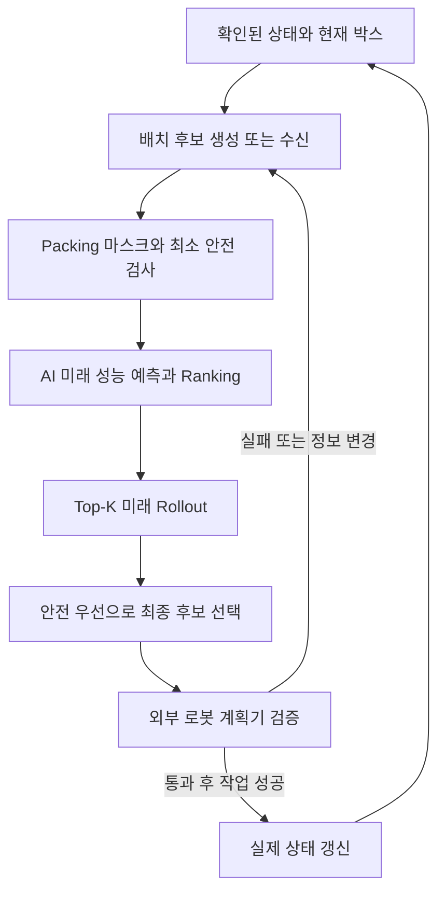

# 점수 기반 패턴 평가: 코드와 동작 해설

설명 대상은 0.3.0이며 알고리즘 코드 기준 커밋은 `66997544747d85a350b9fe14f2527491e6029c1a`입니다. 회의 정리와 미션 요구사항의 연결은 [DESIGN_DECISIONS.md](DESIGN_DECISIONS.md), [MISSION_REVIEW.md](MISSION_REVIEW.md)에 기록돼 있습니다.

이 프로젝트는 현재 박스를 놓을 수 있는 후보들을 받아 안전을 확인하고, 앞으로 들어올 박스까지 고려해 후보를 비교하고, 선택 근거와 실행 검증 상태를 반환합니다. 기존 학습 모델에 물리 단위 평가 지표·순서 검사·로봇 연동을 추가한 버전입니다.

## 1. 먼저 구분할 세 가지

| 구분 | 하는 일 | 대표 파일 |
|---|---|---|
| 미래 성능 예측 | 이 후보를 선택하면 이후 적재가 얼마나 잘 될지 빠르게 추정 | `model.py`, `artifacts/ranker.json` |
| 점수 평가 | 안전·공간·미래 가치·위험·시간을 기준으로 후보를 비교 | `scoring.py`, `rollout.py` |
| 실행 검증 | 외부 로봇 검사 결과를 받아 지금 실행 가능한지 확인 | `contracts.py`, `planner.py`, `sequence.py` |

AI가 예측하는 수치와 최종 평가식의 가중치는 서로 다른 대상입니다. 신경망 내부에는 학습되는 수천 개의 파라미터가 있고, 평가식에는 사람이 해석할 수 있는 여섯 개의 중요도 가중치가 있습니다. 두 종류 모두 조정 경로를 갖지만 같은 학습기로 동시에 갱신하지는 않습니다.

현재 후보 하나는 현재 박스의 `position_m=[x,y,z]`, `yaw_deg=0 또는 90`입니다. 여러 박스의 전체 배치를 신경망이 한 번에 출력하는 구조는 아닙니다. 한 박스의 후보를 미래 배치와 함께 평가하고, 실제 상태가 바뀌면 다음 박스에서 다시 판단합니다.

## 2. 전체 동작



기본값은 Top-K 4개, 미래 시나리오 6개, 최대 미래 박스 6개입니다. 상위 후보가 4개보다 적으면 있는 후보만 평가합니다. 확인된 preview를 미래 시나리오의 앞부분에 유지하며 그 이후 순서만 샘플링합니다.

로봇 검증은 외부 검사 결과가 있으면 후보 필터 단계에도 적용합니다. 위 그림은 처음 제안을 받은 뒤 로봇 검증 결과를 붙여 재평가하는 왕복 흐름을 나타냅니다. `proposal` 응답을 곧바로 로봇 실행 명령으로 쓰면 안 됩니다.

학습용 경로는 다릅니다. Teacher는 현재 생성된 유효 후보 전체를 상세 Rollout해 표적을 만들고, 실행 경로는 학습 모델로 후보를 줄인 후 상세 Rollout합니다. 회의의 “Candidate Ranking 유지, PPO는 추후 상위 행동 선택” 결정이 여기에 반영돼 있습니다.

## 3. 저장소의 큰 폴더

| 위치 | 역할 | 처음 읽을 때 볼 것 |
|---|---|---|
| 저장소 루트 | 설치·실행 입구와 출처 설명 | `README.md`, `pyproject.toml` |
| `projects/` | 프로젝트를 담는 Python 패키지 공간 | 실제 구현은 아래 평가 폴더 |
| `projects/pattern_evaluation/` | 평가·AI·미래 탐색·연동·학습 코드 | `planner.py`, `scoring.py`, `rollout.py`, `model.py` |
| `pacdata/` | 기하 검사, 관측 구성, 시험용 데이터 생성의 공통 코어 | `packing.py`, `observe.py` |
| `projects/pattern_evaluation/artifacts/` | 저장된 모델·가중치·학습 표적·실험 결과 | `ranker.json`, `learned_config.json`, `training.json` |
| `projects/pattern_evaluation/examples/` | 미션 연동을 설명하는 작은 입력·출력 예제 | `mission_request.json`, `mission_result.json` |
| `projects/pattern_evaluation/tests/` | 변경 시 깨지면 안 되는 동작 검사 | `test_planner.py`, `test_mission.py` |
| `.github/workflows/` | GitHub에서 자동으로 설치·검사하는 설정 | `checks.yml` |

`pacdata`는 이전 탑뷰 데이터셋 작업과 공유했던 모듈명을 유지합니다. 이 독립 저장소에 이전 이미지 데이터셋 전체가 들어 있다는 뜻은 아닙니다. 실행에 필요한 기하·관측·합성 시험 기능만 포함합니다. 카메라 영상에서 박스를 검출하는 비전 모델 자체는 포함하지 않습니다.

새 학습을 실행할 때 `runs/`를 출력 경로로 만들 수 있습니다. 이것은 새 실험 결과를 기존 배포 파일과 구분해 보관하는 공간입니다. 설치 과정의 `build/`, `*.egg-info/`는 패키징 과정에서 생기는 파일이며 적재 판단 기능이 아닙니다.

## 4. 루트 파일과 설명 문서

| 파일 | 읽는 목적 |
|---|---|
| 루트 `README.md` | 프로젝트가 무엇인지, 설치·실행·문서 입구 확인 |
| `pyproject.toml` | Python 패키지명·버전·의존성·`ahead-planner` 명령 등록 |
| `requirements.txt` | 실행에 필요한 NumPy 설치 범위 |
| `PROVENANCE.md` | 탑뷰 데이터셋 저장소에서 어떤 기준으로 분리했는지 확인. 분리 당시 기록이므로 당시 버전/검사 수와 현재 수가 다를 수 있음 |
| `NOTICE.md` | 합성 예제·실측 자료의 범위와 라이선스 지정 상태 확인 |
| 평가 폴더 `README.md` | 학습·가중치 조정·연동의 상세 실행 방법 |
| `DESIGN_DECISIONS.md` | 회의 결정이 구현에 어떻게 연결됐는지 확인 |
| `INTEGRATION.md` | 인식·후보 생성·로봇 제어 사이에 주고받을 필드와 상태 계약 |
| `VALIDATION.md` | 기존 배포 모델의 학습과 864회 검증 기록 |
| `MISSION_REVIEW.md` | 미션 요구사항 대응, 0.3.0 보완, 추가 72회 검증과 남은 범위 |

`__init__.py`는 폴더를 Python 모듈로 사용하고 `Planner`, `evaluate_sequence`를 외부에 내보내는 입구입니다. 여기서 별도의 적재 학습을 수행하지 않습니다.

## 5. `planner.py`: 전체 판단을 묶는 파일

외부에서는 `Planner.released()`를 프로세스 시작 시 한 번 만들고, 박스가 들어올 때마다 `planner.plan(observation, candidates=...)`를 호출합니다.

| 기능 | 쉬운 설명 |
|---|---|
| `load_config()` | 설정을 읽고 가중치를 정규화하며 탐색·안전 설정 확인 |
| `prepare_observation()` | 입력 복사, 필수 필드·중복 ID·단위 확인. 평가가 입력을 바꾸지 않게 준비 |
| `Planner.released()` | 배포된 학습 모델과 조정된 가중치 사용 |
| `_evaluate()` | 후보 검사 → AI Ranking → 상세 미래 탐색 → 후보 선정 |
| `_placement_response()` | 선정 이유, 물리 지표, 로봇 검증 상태를 응답으로 정리 |
| `plan()` | 정상 적재뿐 아니라 재측정·NG·선반·대기·마감 같은 행동 선택 |
| `to_packing_env_action()` | 버퍼 없는 단순 시험 환경이 이해하는 행동 이름으로 변환 |

입력은 이미 해석된 상태입니다. `current_box`에 박스 크기·무게·손상 여부가, `placed_boxes`에 현재 위치·회전·지지 관계·상부 하중이, `unseen_inventory`에 아직 모르는 순서의 SKU별 수량이 들어갑니다.

박스가 손상됐다는 정보는 앞단이 제공합니다. 이 파일이 사진을 보고 손상을 분류하거나 저울 없이 무게를 알아내지는 않습니다.

기본 판단은 다음과 같습니다.

| 상황 | 반환 행동 | 이후 처리 |
|---|---|---|
| 상태가 확인되지 않았거나 하중/지지 정보가 모순 | `HOLD` | 관측 정합성 복구 |
| 현재 박스 손상 관측 | `ROUTE_NG` | 정상 선반과 다른 경로 |
| 현재 크기·무게 측정 불확실 | `REMEASURE` | 측정/복구 후 같은 박스로 재요청 |
| 현재 박스를 놓을 후보가 있음 | `PLACE_CURRENT` | 로봇 검증·작업 성공 후 실제 상태 갱신 |
| 현재 박스가 막혔고 선반 박스를 꺼내 놓을 수 있음 | `RETRIEVE_BUFFER` | 선반 목록에서 제거, 대기 중인 현재 박스는 유지 |
| 배치가 막혔고 선반 여유와 이동 횟수 조건 충족 | `BUFFER_CURRENT` | 선반으로 이동 후 다음 입고 처리 |
| 유한 후보 탐색에서 적재할 곳이 없고 선반 처리도 어려움 | `PALLET_CLOSE` | 팔레트 교체 판단/제어 |
| 현재 박스가 없고 추가 입고가 예상됨 | `WAIT` | 미입고 물량을 바로 누락으로 처리하지 않음 |
| 입고 종료와 재고 소진 확인 | `DONE` | 작업 완료 |

`PALLET_CLOSE`는 이 후보 생성기가 유효 위치를 찾지 못했다는 의미도 포함합니다. 팔레트 내부의 모든 연속 좌표를 완전 탐색해 “어떤 배치도 절대 불가능하다”고 증명한 것은 아닙니다.

로봇 검사 때문에 후보가 사라지면 공간 부족과 구분해 `HOLD`로 재검증/재계획을 요청합니다. 모델이 없거나 지정된 OOD 조건이면 `ahead` 경로는 유효 후보 전체 Rollout으로 대체합니다. OOD는 학습 범위와 다른 조건이라는 뜻이며 현재 감지는 명시적 표식·센서 오차·치수 비율의 간단한 조건입니다.

`future_cache`는 같은 상태·후보·미래 표본의 Rollout을 다시 계산하지 않기 위한 재사용 공간입니다. 새로운 정답을 학습하거나 실제 적재 상태를 저장하는 메모리는 아닙니다.

## 6. `pacdata/packing.py`: 물리적으로 불가능한 배치 제거

이 공통 코어는 직육면체 경계와 접촉을 계산합니다.

| 기능 | 동작 |
|---|---|
| `dims()` | 회전각에 따른 박스 가로/세로 계산 |
| `bounds()` | 박스의 최소·최대 x/y/z 범위 계산 |
| `mask()` | 경계·겹침·높이·방향·질량·지지·상부 하중 제약 검사 |
| `generate_candidates()` | 팔레트 모서리, 기존 박스 옆·상단 모서리를 기준으로 유한한 후보 생성 |
| `apply_placement()` | 가상으로 배치하고 지지 체인 전체의 상부 하중 갱신 |
| `immediate_score()`, `greedy()` | 낮은 배치 등 단순 기하 기준의 비교 정책 |
| `PackingEnv.reset()/step()` | 기본 적재·재측정·손상 분기를 시험하는 환경 |

회의의 “불가능은 Mask, 현재 가능하지만 미래 불리는 AI/Future Rollout”을 구현합니다. 경계를 넘거나 박스가 겹치면 효율 점수가 높아도 선택하지 않습니다.

현재 구현은 바닥 또는 하부 박스 하나가 윗박스 전체 바닥을 지지해야 합니다. 윗박스가 바로 아래 박스보다 무거운 배치도 금지합니다. 여러 박스가 함께 지지하는 다중 지지와 옆으로 눕힌 회전은 지원 범위가 아닙니다.

상부 하중은 kg가 아니라 N입니다. 예를 들어 5 kg 박스를 올리면 약 49.05 N이 아래 지지 체인에 추가됩니다. 바로 아래 상자뿐 아니라 그 아래까지 전달되는 하중을 검사합니다.

`apply_placement()`가 계산한 것은 계획/시험 상태입니다. 실물 로봇이 놓는 데 실패했다면 그 상태를 실제 `placed_boxes`로 확정하지 않습니다.

## 7. `scoring.py`: 담당 평가식의 중심

여기서 “지금 이 위치가 얼마나 좋은가”를 계산합니다. 안전 조건과 효율 점수는 별도로 비교합니다.

**안전 비교**

먼저 최소 CoG 여유 같은 기준을 통과해야 합니다. 그 다음 목표 안전 수준까지의 점수는 현재 구현에서 CoG 여유와 최소 하중 여유 중 약한 값을 기준으로 정합니다. 지지는 공통 코어에서 완전 지지를 요구해 이미 검사합니다.

예를 들어 효율 0.9/안전 0.7인 후보와 효율 0.4/안전 1인 후보라면 목표 안전 수준을 확보한 후자를 먼저 선택합니다. 두 후보가 모두 목표 미달이면 안전이 더 높은 후보를 먼저 비교하고, 모두 목표 이상이면 효율 점수로 비교합니다. 안전 점수 1은 설정된 목표에 도달했다는 뜻이며 실물 붕괴 확률 0을 뜻하지 않습니다.

**공간 비교**

같은 박스를 어디에 놓아도 현재 체적 증가는 같습니다. 위치 차이를 비교하려면 남는 공간의 형태가 필요합니다.

| 요소 | 비교하는 이유 |
|---|---|
| 가장 큰 연결 빈 공간 | 큰 박스가 들어갈 연속 공간을 남겼는가 |
| 단편화 | 빈 공간이 작은 조각으로 흩어졌는가 |
| 높이 편차 | 표면 높이가 지나치게 들쭉날쭉한가 |
| 잔여 SKU footprint 수용 | 남은 박스의 바닥 크기가 빈 영역에 들어갈 수 있는가 |

`height_grid()`는 6×6 높이 격자를 만들고, `free_patches()`는 연결된 빈 바닥 영역을 찾습니다. `static_components()`가 공간·안전·균형·시간을 묶습니다. 현재 공간식 내부 비중 0.35/0.35/0.20/0.10은 고정값입니다. 잔여 박스 footprint 검사는 빈 바닥 격자의 근사이며 모든 상부 공간을 정확히 탐색하는 검사는 아닙니다.

**최종 효율식**

`efficiency_score()`는 다음을 계산합니다.

`Q = w_space × 공간 + w_future_fit × 미래 박스 수용 + w_future_volume × 미래 추가 부피 − w_risk × 하방 위험 + w_balance × 균형 − w_handling × 작업 비용`

| 가중치 | 현재 배포값 | 뜻 |
|---|---:|---|
| `space` | 0.3375 | 남는 공간의 질 |
| `future_fit` | 0.2532 | 미래 박스 수용 비율 |
| `future_volume` | 0.1221 | 미래 추가 적재 부피율 |
| `risk` | 0.1830 | 나쁜 미래 결과와 차단 위험 비용 |
| `balance` | 0.0770 | 무게중심 균형 |
| `handling` | 0.0272 | 작업시간 비용 |

`normalized_weights()`는 이 여섯 값을 합계 1로 정규화하며 음수·NaN 등을 거절합니다. `score_terms()`는 최종 점수에 각 항목이 몇 점을 더하거나 뺐는지 반환합니다. `priority()`는 효율 점수보다 먼저 안전 수준을 비교하는 규칙입니다.

로봇 계획기가 현재 상태에 맞는 사이클 시간을 제공하면 작업 비용에 `min(1, seconds/20)`을 사용합니다. 없으면 좌표 기반 대용값을 사용합니다. 로봇 검증 시간·후보 생성시간은 작업 사이클과 별개로 반환합니다.

신규 접촉면·하중 지도 전체가 이 여섯 항목의 추가 학습 가중치로 연결된 것은 아닙니다. 현재는 안전 마스크/안전 우선 비교와 설명 지표로 활용합니다.

## 8. `model.py`: AI가 실제로 배우는 부분

`Ranker.predict()`는 후보마다 네 개의 미래 결과를 예측합니다.

| 출력 | 쉬운 뜻 |
|---|---|
| `mean_fit` | 미래 샘플에서 평균적으로 몇 비율의 박스를 놓았는가 |
| `mean_volume` | 팔레트 용량 대비 미래 추가 적재 부피가 얼마인가 |
| `cvar_fit` | 결과가 나쁜 쪽 표본들의 평균 수용 비율 |
| `block_rate` | 미래 중간에 다음 박스를 놓지 못한 샘플 비율 |

이 네 결과를 점수식으로 조합해 Ranking합니다. `risk`는 네 출력에서 계산하는 파생값입니다. 후보 번호 하나만 외워 출력하는 분류기와 달리, 가중치를 바꾸면 미래 결과 벡터를 새 중요도로 다시 조합할 수 있습니다. 큰 가중치 변경의 성능은 별도 검증해야 합니다.

입력 특징은 총 115개입니다. `pacdata/teacher.py`가 좌표·치수·질량·CoG·재고·센서·preview·5×5 높이 요약의 103개 기본 특징을 만들고, `scoring.feature_vector()`가 공간·안전·하중·균형·시간·선반 등의 12개를 더합니다.

위치와 박스 크기는 팔레트 크기로, 질량은 팔레트 허용 질량으로 정규화합니다. 예를 들어 x=0.6 m/팔레트 길이=1.2 m이면 위치 특징은 0.5입니다. 회의에서 규격 변경에 대응하기 위해 요구한 정규화입니다. 입력의 preview 칸은 최대 12개지만 기본 Rollout horizon은 6개입니다.

배포 모델은 `115 입력 → 48개 숨은 값 → 4 출력`의 작은 NumPy MLP이고 파라미터는 5,764개입니다. GPU/PyTorch 없이 실행합니다. `Ranker.load()/save()`는 JSON 체크포인트를 읽고 저장하고, `arrays()`는 학습 표적을 배열로 변환합니다.

`train()`은 Teacher의 미래 결과와 예측값 차이를 줄이는 학습과 후보 그룹의 상대 순서를 맞추는 학습을 함께 수행합니다. Adam 업데이트가 신경망 내부 파라미터를 조정합니다. `ranking_metrics()`는 Teacher 최선 후보가 Top-K 안에 들어왔는지 등을 확인합니다.

배포 기록은 100 epoch를 평가한 뒤 validation 오차가 가장 작은 1 epoch 체크포인트를 선택했습니다. 한 epoch 안에도 여러 미니배치와 후보 그룹 업데이트가 있습니다. 이후 학습이 계속 좋아졌다고 설명할 수는 없습니다. 기존 시험의 Teacher 최선 Top-4 포함률은 약 73.1%이고 Top-1 일치율은 약 26.9%입니다. AI만으로 최종 결정을 끝내지 않고 Rollout을 더하는 이유입니다.

0.3.0에서 기존 신경망과 학습 가중치 파일은 보존했습니다. 새 물리 지표를 모두 신경망 입력에 넣어 재학습한 버전은 아닙니다. 신경망의 시간 특징도 과거 학습과 일치하도록 기존 기하 대용값을 유지하고, 외부 로봇 시간은 최종 점수의 시간 비용에 반영합니다.

## 9. `rollout.py`: 현재 선택 이후를 가상으로 확인

`sample_futures()`가 가능한 미래 순서를 만들고 `future_metrics()`가 그 순서에서 박스를 가상으로 쌓습니다.

먼저 현재 후보 위치에 현재 박스를 놓습니다. 그 다음 미래 박스의 가능한 위치를 만들고, 단순한 Greedy 기준으로 하나씩 놓습니다. 다음 박스가 들어갈 곳이 없으면 그 시나리오를 중단해 차단을 기록합니다. 미래 탐색의 후보는 기본 최대 16개입니다.

미래 샘플은 랜덤, 큰 박스 후반, 무거운 박스 후반, 작은 박스 우선, SKU 연속, 작은/큰 박스 교차의 여섯 방식입니다. 실제 미입고 순서를 맞히는 별도 시계열 예측 모델을 학습한 것이 아니라, 알려진 SKU 수량에서 여러 가능한 순서를 만드는 방식입니다. 확인된 preview의 순서는 유지합니다.

각 현재 후보에 같은 미래 표본을 사용합니다. 어떤 후보에만 우연히 쉬운 미래를 주어 비교가 불공정해지는 일을 줄입니다.

하방 위험은 `min(1, mean_fit − cvar_fit + 0.5 × block_rate)`입니다. 평균이 좋더라도 나쁜 쪽 결과가 크게 떨어지거나 자주 막히면 감점합니다. 기본 `cvar_fraction=0.25`와 표본 6개에서는 `ceil(6×0.25)=2`, 즉 나쁜 두 표본의 평균을 사용합니다. 실현 확률이 보정된 통계적 붕괴/실패 확률은 아닙니다.

Teacher와 Runtime 모두 유한 후보·샘플 미래·제한 horizon·Greedy 후속 배치를 사용합니다. 전체 순열과 모든 연속 위치의 최적해를 찾는 계산은 아닙니다. 미래 Rollout에는 실제 로봇 IK/경로 검사가 포함되지 않습니다.

## 10. 학습 준비와 가중치 조정 파일

| 파일/함수 | 역할 |
|---|---|
| 평가 폴더 `teacher.py / label_observation()` | 외부 관측·후보 전체를 마스크 후 Rollout해 학습 표적 생성 |
| `experiment.py / make_episodes()` | 학습/검증에 쓸 재고 그룹·시나리오·카메라 조건 조합 |
| `collect_labels()` | 진행 중 선택한 상태의 모든 유효 후보에 Teacher 표적 생성 |
| `run_episode()` | 박스 도착부터 팔레트 마감까지 정책을 적용하며 성능 측정 |
| `summarize()` | 여러 실행의 평균·하위 성능·시간·위반 집계 |
| `validation_objective()` | 가중치 설정을 선택할 기준 계산 |
| `tune_weights()` | 여러 여섯 가중치 조합 실행 → 좋은 조합 주변 재탐색 → 민감도/Pareto 비교 |
| `paired_report()` | 같은 조건의 정책들을 짝지어 비교 |
| `train.py / pipeline()` | 데이터 생성→신경망 학습→가중치 탐색→미사용 시험까지 전체 실행 |
| `fit.py / require_disjoint()` | 학습과 검증 재고 그룹 중복 방지 |
| `select_weight_episodes()` | 재고 그룹·시나리오를 고르게 선택하고 test 입력 거절 |
| `fit ranker` | 이미 만든 Teacher 표적으로 신경망만 재학습 |
| `fit weights` | 이미 학습된 신경망을 유지하면서 여섯 평가 가중치만 탐색 |

두 개의 `teacher.py`는 역할이 다릅니다. `pacdata/teacher.py`는 기본 특징 추출기이고, 평가 폴더의 `teacher.py`가 현재 Teacher 표적 생성기입니다.

배포 학습 데이터는 학습 상태 557개/후보 7,757개, 신경망 검증 상태 111개/후보 1,247개입니다. `collect_labels()`는 에피소드에서 일정 간격으로 최대 몇 개의 상태를 뽑으므로 모든 도착 시점에 표적을 만든 기록은 아닙니다.

여섯 평가 가중치의 자동 탐색은 반복 샘플링 방식입니다. 여러 가중치 조합으로 에피소드를 실행하고, 좋은 조합의 평균 주변에서 다음 조합을 다시 뽑습니다. 배포 기록은 23개 설정과 12개 민감도 변형을 평가했습니다.

선택 기준은 `평균 체적률 + 0.2×정상 박스 성공률 + 0.1×체적률 하위 10% 분위수`입니다. 마스크/하중 위반 설정은 제외합니다. 계산된 후보 점수만 높아지는 설정을 고르는 것이 아니라 실제 시험을 끝까지 진행한 KPI로 비교합니다.

Pareto 비교는 적재율·나쁜 쪽 적재율·대용 작업시간 사이의 장단점을 봅니다. 현재 선택 목적식에 실측 로봇 시간이 직접 들어가는 것은 아닙니다. 실측 시간 최적화를 하려면 시험 환경에도 같은 로봇 시간 모델을 연결해야 합니다.

신경망 학습/신경망 검증/가중치 검증/최종 시험은 재고 그룹을 나눕니다. 같은 재고의 카메라 변형을 학습과 시험에 나누면 사실상 비슷한 문제를 다시 보고 시험하는 결과가 될 수 있어 그룹 중복을 금지합니다.

운영 중 매 박스마다 신경망과 여섯 가중치를 자동 재학습하지는 않습니다. 매 박스마다 바뀌는 것은 입력 상태에 대한 예측과 순위입니다. 새 데이터로 별도 학습·검증하고 새 파일을 배포할 수 있습니다. 안전 기준과 공간식 내부 비중은 이 자동 가중치 탐색의 대상이 아닙니다.

## 11. `contracts.py`: 모듈 사이의 약속과 상태 확인

입력 형식이 맞아도 센서 상태가 서로 모순일 수 있습니다. 예를 들어 기존 박스가 사라졌는데 다른 박스가 그 박스를 지지 ID로 가리키거나, 팔레트가 작아졌는데 기존 박스가 바깥에 남으면 앞으로의 점수 계산을 시작하기 전에 확인이 필요합니다.

| 함수 | 확인/변환 |
|---|---|
| `number()`, `valid_measurement()`, `validate_box()` | 값의 형태, 양수 물성, 회전·용량·선반 이동 횟수 |
| `validate_contract()` | m/kg/N, 팔레트 좌표계, ID, preview, 선반·공정·로봇 설정 |
| `state_errors()` | 실제 배치를 지지 순서로 재구성해 경계·하중·지지 정보 대조 |
| `preview_box()` | 확인된 preview를 가상 검증용 박스 정보로 변환 |
| `buffer_observation()` | 선반 회수 대상과 대기 중인 컨베이어 박스를 함께 평가할 관측 구성 |
| `state_token()`, `placement_token()` | 검사 당시 상태·위치·파지/접근 ID를 식별하는 해시 |
| `robot_assessment()` | 외부 검사 결과가 현재 후보에 해당하는지, 모두 통과했는지 판단 |

토큰은 “현재 검사 결과가 어느 상태의 어느 후보에 대한 것인가”를 대조합니다. 박스나 팔레트, 장애물 장면, 파지/접근 조건이 바뀌면 이전 검사 결과를 그대로 쓰지 않습니다. 해시는 외부 검사기가 실제로 검사를 했는지 인증하는 장치가 아니며 신뢰되는 모듈의 결과를 받는 계약입니다.

외부에서 제공할 로봇 검사는 다음 여섯 가지입니다.

| 검사 | 뜻 |
|---|---|
| `reachability` | 로봇이 해당 작업 영역에 도달할 수 있는가 |
| `ik` | 목표 자세를 만들 관절 각도 해가 있는가 |
| `collision_free` | 계획된 작업에서 로봇·그리퍼·주변 물체가 충돌하지 않는가 |
| `payload` | EOAT와 박스의 질량·로드 조건을 포함해 작업 가능한가 |
| `grasp_direction` | 요구한 방향으로 잡을 수 있는가 |
| `approach_pose` | 제안된 접근 자세로 작업할 수 있는가 |

이 저장소는 해당 IK/충돌 해석기를 내장하지 않습니다. 박스+EOAT 질량의 간단한 사전 검사는 수행하고, 상세 검사는 외부에서 받습니다. 여섯 검사가 true이고 상태/장면 버전과 토큰이 일치하면 `execution_ready=true`를 반환합니다.

`proposal` 모드는 후보 제안을 허용하고 미검증을 표시합니다. `validated` 모드는 완전한 검사 결과가 없는 후보를 선택하지 않습니다. 처음 연결할 때는 제안→외부 검사→검사 결과 첨부→validated 재요청 순서로 사용합니다.

## 12. `metrics.py`: 점수를 실제 수치로 설명

`pattern_metrics()`는 배치 전후의 상태에 대해 체적률, 바닥 점유율, 전체 질량·허용 질량 여유, 최대 높이, m 단위 CoG, 박스별 상부 하중, 접촉면적과 지지율을 계산합니다.

`scoring.py`는 후보를 비교하기 위한 평가 기준을 만들고, `metrics.py`는 선정 이유를 물리 단위와 KPI로 확인할 자료를 만듭니다. 신규 지표 전부가 신경망 입력이나 별도 가중치 항목인 것은 아닙니다.

지지 안정성은 해당 박스뿐 아니라 그 위에 실린 전체 구조의 CoG를 접촉면과 비교합니다. 바닥 하중 지도는 바닥 박스의 footprint에 전달 하중이 균등 분포한다고 가정해 4분할합니다. 실제 접촉 압력과 박스 변형을 계산한 결과는 아닙니다.

`collapse_probability=null`, `dynamic_validation=NOT_CHECKED`는 실제 붕괴 확률/동역학을 검증하지 않았다는 뜻입니다. 미래 `risk`와 이 물리 안정성 지표는 서로 다른 의미입니다.

## 13. `sequence.py`: 여러 박스의 순서를 검사

`evaluate_sequence(observation, steps)`에 박스 ID와 배치 후보를 순서대로 전달합니다. 앞 단계에서 쌓은 박스를 다음 단계의 지지와 하중 상태에 반영합니다.

예를 들어 A를 바닥에 놓고 B를 A 위에 올리는 순서는 가능할 수 있지만, A가 아직 없는 상태에서 B를 공중에 놓는 순서는 거절합니다. 현재/확인된 preview의 입고 순서를 뒤집거나 아직 순서를 모르는 미입고 박스를 임의로 끼워 넣는 것도 거절합니다. 실제 선반 박스는 그 사이에 선택할 수 있습니다.

이 함수는 지정된 순서를 검사합니다. 새로운 순서 전체를 최적화하는 알고리즘은 아닙니다. 각 단계의 `current` 점수를 계산하며 `mean_static_score`는 전체 미래 Rollout 점수와 다릅니다.

packing 검사를 완료해도 로봇 검사 결과가 없으면 `PACKING_VALID_REQUIRES_ROBOT`입니다. 로봇 검사 실패로 중단되면 남은 packing 검사를 하지 못했음을 `packing_valid=null`로 표시합니다. 실제 실행에서는 각 박스 작업 후 센서로 상태를 확인하고 다음 단계를 재검증합니다.

## 14. 선반과 PPO의 현재 위치

선반은 `buffer_boxes`로 표현합니다. 정상 순서 조정용 선반과 NG/Inspection 영역을 구분합니다. 기본 선반 개수 용량은 2이고, 하나의 박스는 선반 방향으로 최대 한 번 보내는 규칙입니다.

현재 규칙은 현재 박스가 배치 가능하면 우선 놓고, 막혔을 때 선반의 놓을 수 있는 박스를 꺼내거나 현재 박스를 보관하는 방식입니다. 현재 박스가 놓일 수 있어도 미래를 위해 일부러 보관하는 최적 정책은 구현돼 있지 않습니다.

시험은 선반 이동당 기본 8초와 선반 박스당 의사결정 단계마다 0.2초의 점유 비용 대용값을 집계합니다. 실제 선반의 체류시간을 적분한 비용은 아닙니다. 선반/재취급 비용이 PPO로 최적화되거나 여섯 후보 가중치의 독립 항목으로 학습된 것도 아닙니다.

선반 상태가 신경망 특징에 포함돼 있어도 배포 학습에서는 선반을 사용하지 않아 해당 특징의 효과를 충분히 학습한 것은 아닙니다. AHEAD+Buffer 결과는 규칙 추가 효과로 설명해야 합니다.

회의에서 PPO를 검토한 위치는 `PLACE_CURRENT / BUFFER_CURRENT / RETRIEVE_BUFFER / PALLET_CLOSE / PARTIAL_REPACK` 같은 시간에 걸친 상위 행동 선택입니다. 현재 학습은 Teacher 모방과 평가 가중치 탐색이며 PPO는 사용하지 않습니다. 이미 쌓은 박스를 옮기는 Partial Repacking도 후속 확장입니다.

## 15. `adapters.py`, `__main__.py`: 다른 결과물과 연결

`reference_candidate()`는 참고 구현의 `i/j` 격자와 z mm를 m 좌표로, 방향 번호 0/1을 yaw 0/90으로 변환합니다. 예를 들어 grid=10 mm, i=20이면 x=0.2 m입니다. `reference_box()`는 mm 박스 치수를 m로 바꾸고 kg/N은 유지합니다.

참고 구현의 옆눕힘 방향 2–5는 명시적으로 거절합니다. 다중 지지까지 자동 번역하는 전체 상태 변환기가 아닙니다. 인식·재고·지지 관계는 [INTEGRATION.md](INTEGRATION.md)의 계약에 맞춰 구성해야 합니다.

`__main__.py`는 같은 Planner를 터미널과 HTTP로 호출하는 입구입니다.

| 명령/경로 | 기능 |
|---|---|
| `plan` 또는 `POST /plan` | 현재 상태로 행동 제안 |
| `teach` | 외부 관측·후보의 Teacher 표적 생성 |
| `evaluate-sequence` 또는 `POST /evaluate-sequence` | 지정된 여러 박스 순서 검사 |
| `visualize` | 결과 SVG 생성 |
| `serve` | HTTP 서비스 시작 |
| `GET /health` | 서버와 모델 로딩 상태 확인 |

ROS2 토픽·서비스 노드나 로봇 드라이버가 이 파일에 구현된 것은 아닙니다. ROS2 쪽에서는 Python import 또는 HTTP 요청을 감싸는 연결부를 작성할 수 있습니다. 판단 코드와 통신 코드를 분리한 구조입니다.

## 16. `visualize.py`와 `examples/`

`scene_data()`는 팔레트와 실제 관측된 박스, 선택한 다음 배치의 3D 형상을 정리합니다. `render_svg()`는 Top view와 등각 3D 보기를 그립니다. 파란 박스는 관측된 상태이고 주황 박스는 제안된 다음 배치입니다.

현재 그림은 현재 상태+선택된 한 배치입니다. 6개 미래 시나리오의 전체 최종 팔레트를 모두 그리거나 로봇 궤적을 시뮬레이션하는 기능은 아닙니다.

| 예제 파일 | 내용 |
|---|---|
| `mission_request.json` | 기존 박스 두 개, 현재 박스 하나, 바닥/상단/겹침 후보 세 개 |
| `mission_result.json` | 위 입력에 대한 실제 저장 응답. 겹침 후보 제거, 두 유효 후보 비교 |
| `mission_preview.svg` | 선택된 바닥 배치를 표시하는 2D/등각 3D 그림 |
| `scene.json` | 표시/외부 시뮬레이터용 3D 형상 자료 |
| `sequence_request.json` | 여러 박스 순서 검사 API 형식의 최소 예제 |

미션 예제는 잔여 박스가 없는 연결 확인용입니다. 그래서 `mean_fit=1`, 미래 추가 부피 0으로 기록됩니다. 미래를 잘 예측했다는 성능 사례로 쓰지 않습니다. 미래 평가 설명에는 아래 `artifacts/sample_observation.json`을 사용합니다.

## 17. `artifacts/`: 학습 결과와 검증 증거

| 파일 | 들어 있는 것 | 코드 수정 파일인가 |
|---|---|---|
| `ranker.json` | 학습된 신경망 파라미터·정규화 통계·특징/출력 이름 | 보통 재학습으로 생성 |
| `learned_config.json` | 선택된 여섯 가중치와 탐색/안전 설정 | 새 검증을 거쳐 적용 |
| `train.labels.jsonl.gz` | 학습 상태별 후보 특징·Teacher 미래 결과 | 압축된 학습 표적 |
| `validation.labels.jsonl.gz` | 별도 신경망 검증 표적 | 압축된 검증 표적 |
| `training.json` | 학습 추이·선택 epoch·Ranking 성능 | 학습 보고서 |
| `weight_search.json` | 가중치별 KPI·선택 설정·민감도·Pareto | 가중치 탐색 보고서 |
| `benchmark_episodes.jsonl.gz` | 기존 864회 실행의 개별 결과 | 시험 결과 |
| `benchmark.json` | 기존 정책별 결과 요약·짝 비교 | 시험 보고서 |
| `manifest.json` | 학습/검증/시험 재고 그룹과 표본 수 | 실험 구성표 |
| `evaluation_state.json` | 재개 시 비교할 고정 모델·설정·코드 정보 | 검증 진행 상태 |
| `release_files.json` | 기존 배포 파일 크기·해시 | 파일 동일성 확인 |
| `sample_observation.json` | 미래 재고가 있는 샘플 입력 | 실행 예제 |
| `sample_result.json` | 기존 배포 당시 샘플 응답 | 과거 출력 예제 |
| `sample_episode_trace.json` | 기존 한 에피소드의 단계별 판단 | 동작 추적 예제 |
| `mission_validation.json` | 0.3.0의 별도 미사용 재고 그룹 72회 실행 | 추가 검증 보고서 |

`.jsonl.gz`는 한 줄에 한 데이터가 있는 JSON을 압축한 파일입니다. 이미지 파일이나 신경망 코드가 아닙니다. 실제로 판단할 때 필수로 읽는 배포 파일은 모델 `ranker.json`과 설정 `learned_config.json`입니다. 학습 표적과 보고서는 재학습/검증/설명을 위해 보관합니다.

구버전 `sample_result.json`과 새 `examples/mission_result.json`은 생성 시점이 다릅니다. 같은 모델·가중치를 유지했어도 새 API에는 점수 기여도·물리 지표·검증 상태 등 추가 필드가 있습니다.

## 18. 검증·재개 파일

`release.py`는 이미 학습된 모델로 전체 비교 검증을 실행·재개합니다. 코드·모델·가중치 해시가 달라지면 같은 중간 결과와 섞지 않도록 새 출력 폴더를 요구합니다. `recover_labels()`는 누락된 표적 복구, `evaluate_release()`는 비교 실행, `initialize()/evaluate_job()`은 병렬 작업을 담당합니다. 기본 결과 폴더 대신 `--out .../runs/release-v0.3`처럼 별도 경로를 사용합니다.

`mission_validation.py`는 모델·가중치를 바꾸지 않고 재고 그룹 42–44, 12개 시나리오, preview2에서 Greedy/AHEAD를 추가 비교합니다. `runtime_fingerprint()`는 실행 코드의 해시를 기록합니다.

| 검사 파일 | 확인하는 것 |
|---|---|
| `test_planner.py` | 마스크 우선, 안전 비교, 미래 prefix, OOD/모델 없음, 선반, 예외 처리, HTTP, 입력 불변성 |
| `test_learning.py` | 학습 가능성, 모델 저장/복원, 재고 그룹 분리, 가중치 검증 표본 선택 |
| `test_mission.py` | 물리 지표, 순서, 로봇 검사 실패/stale 결과, EOAT, 팔레트 변경, 96개 제약 조합, 시각화·API |
| `.github/workflows/checks.yml` | GitHub에서 설치·위 테스트·소스 폴더 밖의 설치 패키지 실행 확인 |

기존 배포는 공통 에피소드 144개에 정책 6개를 적용한 864회 비교입니다. 추가 시험은 에피소드 36개에 정책 2개를 적용한 72회입니다. 서로 다른 시험 구성이므로 두 평균 적재율을 버전 간 개선량으로 빼면 안 됩니다.

기존 합성 시험의 평균 체적률은 Greedy 17.84%, AHEAD 19.45%, AHEAD+Buffer 22.99%입니다. 별도 추가 시험은 Greedy 14.99%, AHEAD 16.58%입니다. 시험은 한 팔레트 마감에서 끝나고 미처리 물량이 남으므로 전체 공정 완료율/처리량을 검증한 것이 아닙니다. 자동 테스트 42개 안에 96개 조합 검사와 로봇 결과 모의 검사가 포함됩니다. 실제 로봇 실험 42회라는 뜻이 아닙니다.

## 19. 실제 샘플 하나를 끝까지 읽기

`artifacts/sample_observation.json`으로 현재 코드를 실행한 결과입니다. 현재 박스는 FLAT, 약 0.3856×0.2541×0.0845 m, 2.065 kg이고 팔레트는 1.0×0.8 m, 최대 높이 0.6 m입니다. 확인된 preview는 2개, 별도 미관측 재고는 19개입니다.

1. 현재 배치 후보 8개를 만들고 모두 packing 검사를 통과합니다.
2. AI가 8개 후보의 미래 성능을 예측해 순위를 매깁니다.
3. 상위 4개를 동일한 미래 시나리오 6개로 상세 Rollout합니다.
4. 안전 우선 비교 후 `[0.7459, 0, 0]` m, yaw 90°를 선택합니다.
5. `PLACE_CURRENT`를 제안하지만 로봇 검사 결과가 없어 `execution_ready=false`입니다.

선택 후보의 미래 샘플 수용 비율은 `[0.5, 0.8333, 0.8333, 1, 1, 0.8333]`입니다. 평균은 약 0.8333, 나쁜 두 개의 평균은 약 0.6667, 최악 표본은 0.5입니다. 여섯 표본 중 네 개에서 모든 미래 박스를 끝까지 놓지 못해 차단 비율은 약 0.6667입니다.

| 점수 기여 | 실제 값(반올림) |
|---|---:|
| 공간 | +0.33398 |
| 미래 박스 수용 | +0.21097 |
| 미래 추가 부피 | +0.01382 |
| 하방 위험 | −0.09152 |
| 균형 | +0.02833 |
| 작업 비용 | −0.00882 |
| 합계 | 0.48675 |

0.48675는 내부 비교 점수입니다. 48.7% 성공 확률이나 48.7% 적재율이 아닙니다. 평균 수용 비율 83.3%도 이 제한된 미래 표본의 결과이며 실제 물류의 성공 확률로 읽지 않습니다. 안전 점수 1은 설정 목표 충족, 로봇 검증 미완료는 별도입니다.

## 20. 설명할 때의 순서와 공유 문안

설명은 전체 문제→안전 검사→미래 평가→두 종류 학습→로봇 연결→현재 검증 범위 순서로 진행하면 이해하기 쉽습니다. 파일명부터 모두 읽어주는 방식보다 샘플 박스 하나가 처리되는 흐름을 먼저 보여주고 각 파일을 연결하세요.

공유 설명 예시:

> 점수 평가 모듈은 현재 박스의 여러 배치 후보 중에서, 안전 조건을 통과하고 앞으로 들어올 박스에도 유리한 후보를 선택합니다. 먼저 경계·겹침·지지·하중을 검사하고, 작은 신경망으로 후보의 미래 성능을 빠르게 예측합니다. 그중 상위 후보만 여러 미래 순서로 가상 적재해 최종 점수를 확인합니다. 안전 목표 미달에서는 안전 개선을 먼저 선택하고, 목표 이상에서는 공간·미래 적재·위험·작업시간을 비교합니다. 신경망 학습과 평가 가중치 탐색은 별도로 수행하며, 로봇 검증 결과를 받으면 실행 불가능한 후보를 제외하고 다시 선정합니다. PPO는 선반 보관·회수 같은 상위 행동 선택의 후속 확장이고, 현재 결과는 합성 환경의 검증입니다.

인식 쪽에 요청할 것은 확인된 박스 물성·실제 배치·재고·센서 상태입니다. 후보 생성 쪽에는 팔레트 좌표계의 위치/회전 목록을 요청합니다. 로봇 쪽에는 후보별 도달성·IK·충돌·payload·파지·접근 검사와 사이클 시간을 요청합니다. 제어기에는 성공 피드백 후 상태 갱신을 맡깁니다. 필드 목록은 [INTEGRATION.md](INTEGRATION.md)에 있습니다.

## 21. 직접 읽고 실행하는 순서

먼저 `examples/mission_request.json`과 `mission_result.json`을 나란히 읽어 입력·출력 모양을 봅니다. 다음은 `planner.py → scoring.py → rollout.py → model.py` 순서로 읽습니다. 그 뒤 `contracts.py`, `metrics.py`, `sequence.py`로 최신 보완 기능을 확인하고, 학습을 바꾸려 할 때 `teacher.py`, `experiment.py`, `train.py`, `fit.py`를 읽습니다.

아래는 Ubuntu/WSL에서 저장소 루트 기준으로 실행하는 명령입니다.

```bash
# 처음 설치
python -m pip install .

# 미래 평가가 있는 샘플 확인
python -m projects.pattern_evaluation plan --input projects/pattern_evaluation/artifacts/sample_observation.json

# 전후 모듈의 연결 예제
python -m projects.pattern_evaluation plan --input projects/pattern_evaluation/examples/mission_request.json
python -m projects.pattern_evaluation evaluate-sequence --input projects/pattern_evaluation/examples/sequence_request.json
python -m projects.pattern_evaluation visualize --input projects/pattern_evaluation/examples/mission_request.json --output preview.svg
```

모델의 미래 예측을 고치려면 `fit ranker`, 평가 중요도를 바꾸려면 `fit weights` 또는 여섯 가중치 설정을 사용합니다. 연결 필드를 바꾸려면 `INTEGRATION.md`와 `contracts.py`를 함께 확인합니다. 안전 기준은 학습 결과가 좋아 보인다는 이유로 낮추지 않고 물성·기계 검증과 함께 관리합니다.
